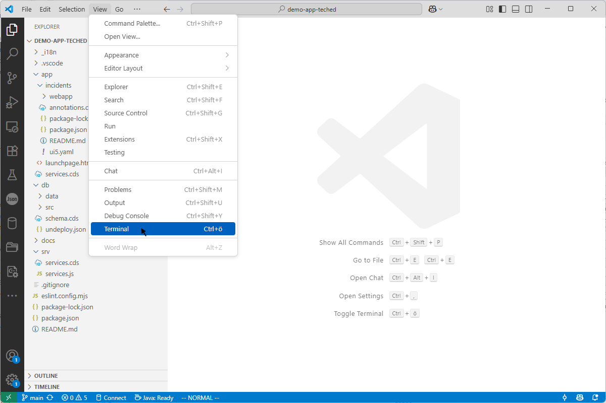
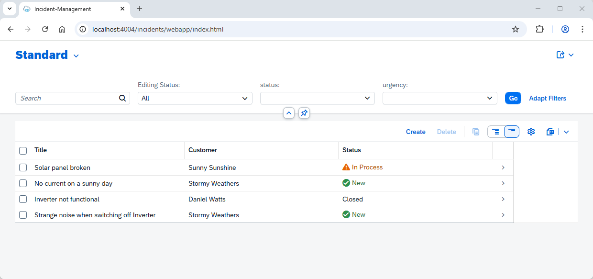

# Exercise 0 - Run the project locally

In this exercise, you will clone a sample application from GitHub and run it locally on your machine. This project is a Full-Stack CAP Application that includes both a backend service and a Fiori Elements / UI5 frontend.
The application corresponds to the SAP tutorial ["Develop a Full-Stack CAP Application Following SAP BTP Developer’s Guide"](https://developers.sap.com/group.cap-application-full-stack.html).

## Exercise 0.1 Clone the repository

After completing these steps you will have a sample application in your machine and will be able to run it locally.

1. Open the Command Prompt or a Windows PowerShell and execute the following command:

   ```sh
   git clone https://github.com/SAP-samples/teched2025-CA262.git
   ```

## Exercise 0.2 Start the server locally

We will use Visual Studio Code (VS Code) as our IDE. It is already installed with all the relevant extensions on these machines.
If you want to install and use it on your own machine, you can follow ["Set Up SAP Fiori Tools in Your Development Environment"](https://developers.sap.com/tutorials/fiori-tools-vscode-setup.html) to get started.

1. Open Visual Studio Code and open the folder `teched2025-CA262` that you just cloned. Then, open a new terminal via `View -> Terminal`.

   

2. There, install the node dependencies by executing the following command:

   ```sh
   npm run install:all
   ```

3. Then, launch the application via:

   ```sh
   npm start
   ```

This starts the CAP server with an in-memory database plus the UI5 server. It will open the page `app/webapp/index.html` in your browser. If this does not happen automatically or if the page does not open in Chrome, open [http://localhost:4004/incidents/webapp/index.html](http://localhost:4004/incidents/webapp/index.html) manually in the Chrome browser.

You will see the Incident Management app, which you might already be familiar with.



Currently, the UI5 app is not built, which means it is not fully optimized for production.
In the next two exercises, you will become familiar with the network tools and learn the differences between a non-built app and a built app.

## Summary

You have now cloned locally our repository that will act as the base application for the subsequent exercises.  

> [!IMPORTANT]
> **Congratulations!** :partying_face:  
> You have completed the first task successfully.  
> After knowing how to run locally the app, we can now continue and further optimize it.  
> Continue now with - [Exercise 1 - Understanding network traffic](../ex1/README.md)
