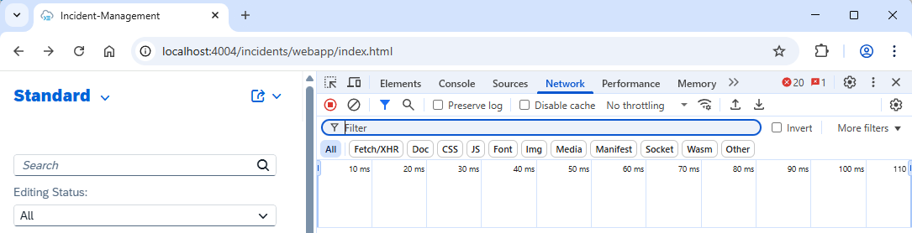
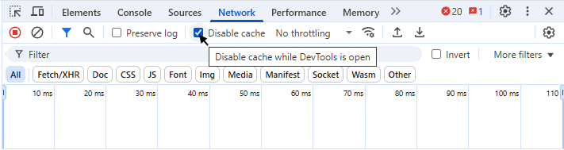
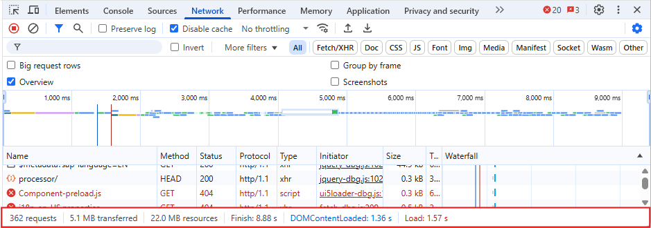
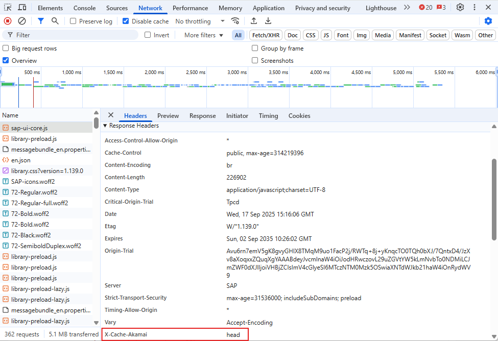
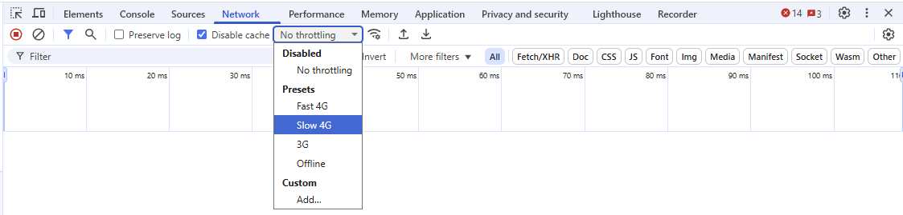
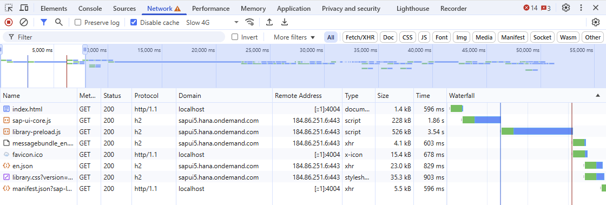
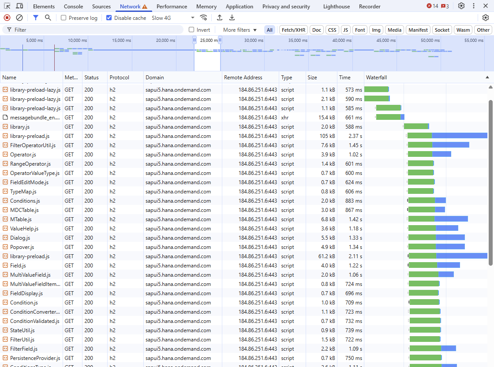

# Exercise 1 - Understanding network traffic

In this exercise, you will analyze the network traffic of the application you started in the Getting Started section. You will use the Chrome Developer Tools to inspect the requests made by the application and understand their size, timing, and caching behavior.
One single measurement can be useful for certain aspects of the analysis but the general recommendation is to iterate at least 10 times to get representative values and to exclude outliers from the measurements. In this exercise, we will do 10 iterations without excluding outliers.

## Exercise 1.1 Open Chrome Developer Tools

With the application running in your browser, open Chrome Developer Tools in the same tab by pressing `F12` or right-clicking anywhere on the page and selecting `Inspect`. Go to the `Network` tab.

## Exercise 1.2 Record the network traffic with disabled cache

1. To record all network requests during the first load of the application, you need to disable the cache in DevTools.

   

   Then clear any previous recordings by clicking the clear button in the Network tab.

   

2. Now reload the page by pressing `F5` or clicking the reload button in the browser. This will record all network activity for the initial load of the application.

3. Inspect the recorded network traffic

   To get familiar with the network traffic and to be able to compare it later with the built version of the app, you should look at the following aspects:

   

   3.1. Number of requests

   Note down the total number of requests made by the application during the initial load. Use the excel `teched2025-CA262-Results.xlsx` located in the root folder.

   3.2. Amount of data transferred and total load time

   Note down the total amount of data transferred and the corresponding uncompressed size of the resources.  
   Also, note the total load time ("Finish") for the initial page load.

4. Content Delivery Network (CDN)

   Most UI5 resources are delivered via a Content Delivery Network (CDN). CDNs are geographically distributed networks of proxy servers and their data centers. The goal is to provide high availability and performance by distributing the service spatially relative to end users.

   You can identify requests that are served via the CDN by looking at the response headers.  
   As SAP is using the Akamai CDN, look for the `X-Cache-Akamai` header in the response of the requests.

   

## Exercise 1.3 Record the network traffic with enabled cache

Now, re-enable the cache in DevTools by unchecking "Disable cache". Clear the previous recording again and reload the page. This will record all network activity for a reload of the application with caching enabled.

1. Inspect the recorded network traffic

   1.1. Number of requests

     Note down the total number of requests made by the application during the reload of the page. Use the excel `teched2025-CA262-Results.xlsx` located in the root folder. Split the number of requests into:

      - requests that were served from cache (disk or memory)
      - requests that were fetched from the server
      - requests that resulted in a 304 (Not Modified) response

     Hint: you can sort the requests by "Size" to group the different categories. In case this column is not visible, right-click on any column header and enable it from the context menu.

   Do you understand the difference between the three categories? Have a look at the following headers in the requests/responses to understand the caching behavior:

      - `Cache-Control` (response) indicating how long the resource can be cached; [see RFC 9111 for reference](https://datatracker.ietf.org/doc/html/rfc9111#section-5.2)
      - `If-None-Match` (request) and `Etag` (response) indicating the ETag of the cached resource; [see RFC 9111 for reference](https://datatracker.ietf.org/doc/html/rfc9111#section-4.3.1)
      - `If-Modified-since` (request) and `Last-Modified` (response) indicating the last modification date of the resource; [see RFC 9111 for reference](https://datatracker.ietf.org/doc/html/rfc9111#section-4.3.1)

   1.2. Amount of data transferred and total load time

     Note down the total amount of data transferred and the corresponding uncompressed size of the resources.
     Also, note the total load time ("Finish") for the initial page load.
     Compare these numbers to the numbers you collected with disabled cache.

## Exercise 1.4 Inspect sequential requests

Requests to remote servers can take a significant amount of time, especially if the server is far away or if the network connection is slow. To optimize the loading time of web applications, browsers can send multiple requests in parallel. However, some requests depend on the results of previous requests and therefore have to be sent sequentially.
In the following, you will identify such sequential requests in the network traffic of the application.

The Chrome DevTools provide a way to simulate different network conditions. Using a slow network connection allows you to better observe sequential requests.

1. Enable network throttling

   Choose "Slow 4G" from the "Throttling" dropdown in the Network tab.

   

2. Identify sequential and parallel requests

   Disable the cache by checking "Disable cache" in the Network tab.
   Clear the previous recording again and reload the page.
   This will record all network activity for the initial load of the application with a slow network connection.

   Now, look at the "Waterfall" column of the first few requests.
   You can zoom to a specific time range by selecting a range in the timeline above the requests.

   You should be able to identify requests that are sent sequentially.

   

   Zoom out again and look for a time range where multiple requests are sent concurrently.
   Since the SAP-UI5 resources are served via HTTP/2, as indicated by the "h2" in the "Protocol" column, you should be able to see multiple requests being sent concurrently.
   For HTTP/1.1, the number of parallel requests was limited to 6 per domain, while HTTP/2 allows parallel requests over a single connection.

   

## Summary

You've now completed Exercise 1, which enables you to understand which requests are being sent, how browser cache works, and how to identify sequential and parallel requests.

> [!IMPORTANT]
> **Kudos!** :trophy:  
> You have completed the first exercise successfully.  
> You seem to become an *Expert* in *Understanding network traffic*.  
> Continue to - [Exercise 2 - UI5 Builder](../ex2/README.md)
