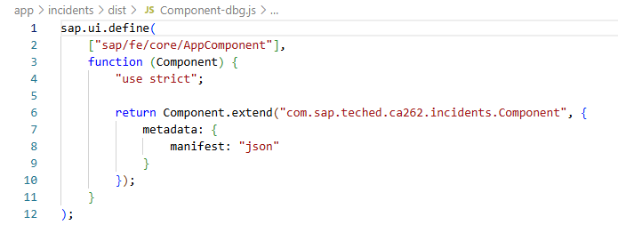
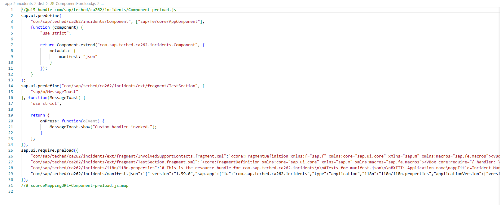
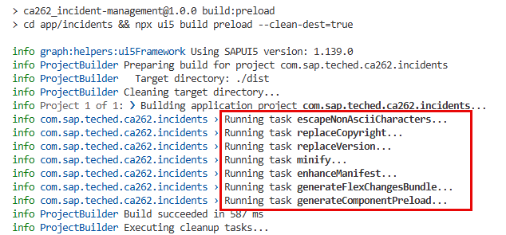
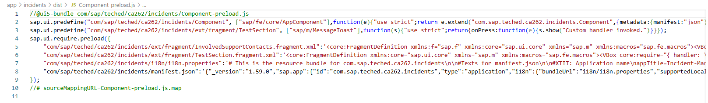

# Exercise 2 - UI5 Build

In this exercise, we will learn how to prepare your application for production using the UI5 CLI.
Typically JavaScript belongs to the interpreted languages, although relevant modern engines use just-in-time compilation for improved performance.
So why do we need a build? A build takes care of standard tasks like replacing copyright and version information, but also performance-related tasks like reducing the size (minify) and bundling the app (merging the separate JavaScript files into one).

## Exercise 2.1 Minify task

After completing these steps you will have learnt what the minify task is and what impact it has on performance.
Minification is the process of removing all unnecessary characters like whitespace characters, comments and changing the variable names to smaller ones, usually one letter, which improves the transfer time over the network and the parsing time in the browser.
It usually achieves a file size reduction of 40-60%.

As we have a Fiori Elements app which almost no custom code, the reduction is obviously not huge, but still we can see how it works. Two additional files will be generated: a <file_name>-dbg.js file with the original content and a <file_name>.map file that maps both files and will be used by the developer tools to show the source code while debugging.

1. Open Visual Studio Code and open the folder `teched2025-CA262`. Then, open a new terminal via `View -> Terminal` or reuse the one you open previously. Finally, run the following command:

   ```sh
   npm run build:minify
   ```

2. Open the folder `app\incidents\dist` and check the contents of the files: `Component.js`, `Component.js.map` and `Component-dbg.js`. Compare them with the content of the file `Component.js` in folder `app\incidents\webapp\`.

   

   

## Exercise 2.2 Generate Component preload task

After completing these steps you will have learnt what the generate component preload task does and what impact it has on performance.

This task bundles all the application specific files into one file called `component-preload.js`. This reduces the number of requests that are being sent to the backend. We have added an extension point so the effect is easier to identify.

1. Go back to Visual Studio Code and open the folder `teched2025-CA262`. Then, open a new terminal via `View -> Terminal` or reuse the one you open previously. Finally, run the following command:

   ```sh
   npm run build:generateComponentPreload
   ```

2. Open the folder `app\incidents\dist` and check the contents of the files: `Component-preload.js`, `Component-preload.js.map` and `Component.js`. Notice how all the application specific files are included and they are also not minimized this time.

   

## Exercise 2.3 Build a production ready app

1. Go back to Visual Studio Code and open the folder `teched2025-CA262`. Then, open a new terminal via `View -> Terminal` or reuse the one you open previously. Finally, run the following command:

   ```sh
   npm run build:preload
   ```

   In the console we can see that 7 tasks have been executed:

   

2. Notice how this time the file `Component-preload.js` is minimized:

   

3. See the running built app in the browser. Open [http://localhost:4004/incidents/dist/index.html](http://localhost:4004/incidents/dist/index.html) and make sure the `component-preload.js` exists.

   

## Summary

You've now learnt how to use the UI5 Build in order to prepare your application for production.

> [!IMPORTANT]
> **Kudos!** :trophy:  
> You have completed the second exercise successfully.  
> You seem to become an *Expert* in *UI5 Build*.  
> Continue to - [Exercise 3 - Analyzing network traffic](../ex3/README.md)
