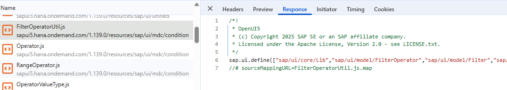
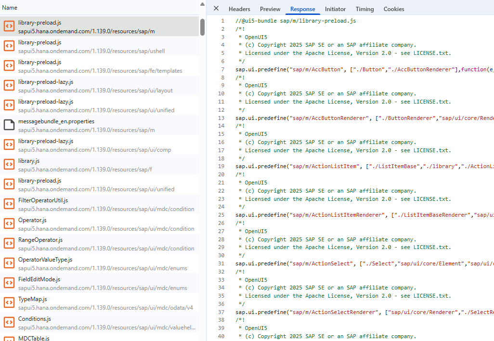
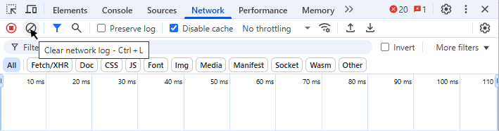
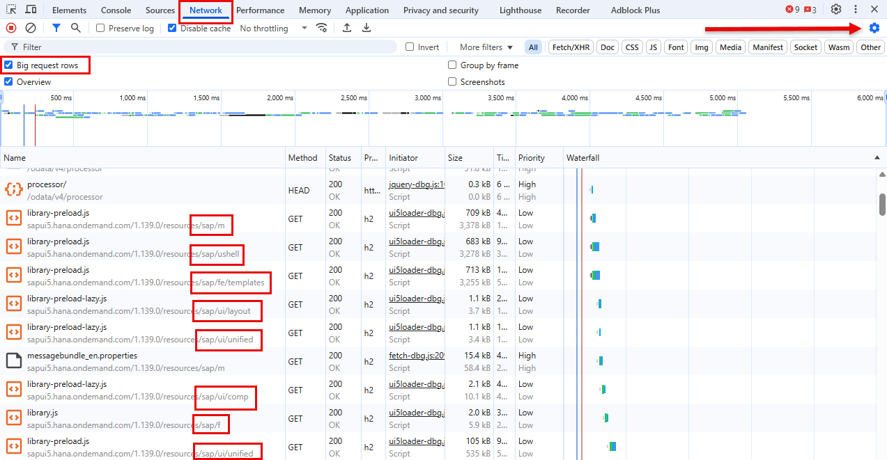
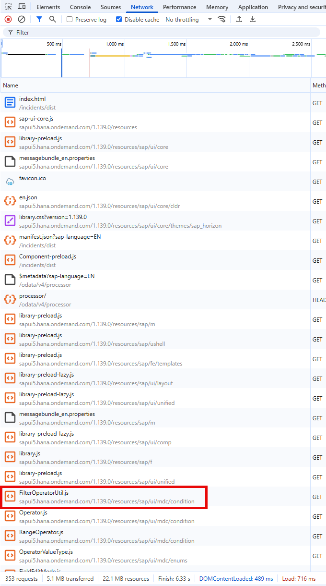
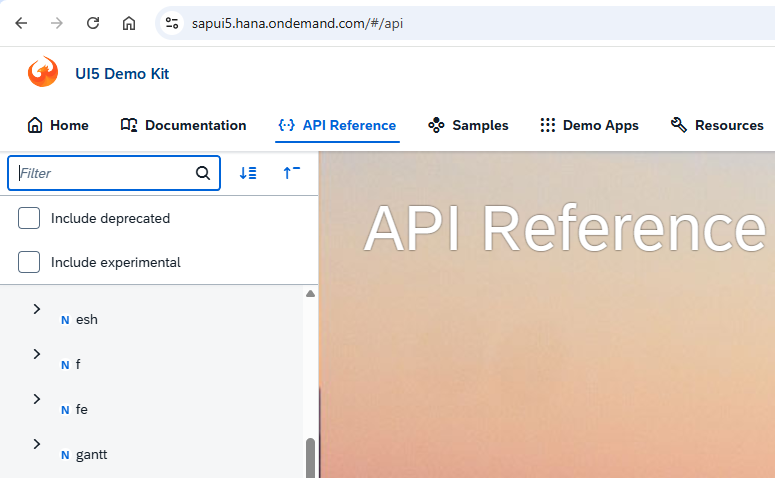
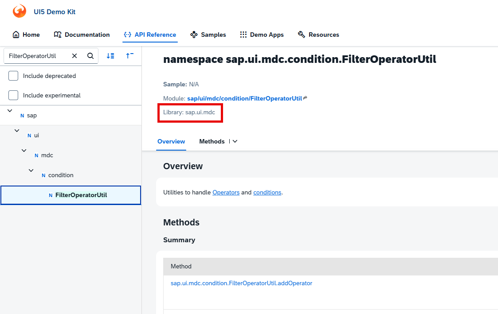
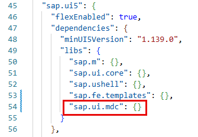
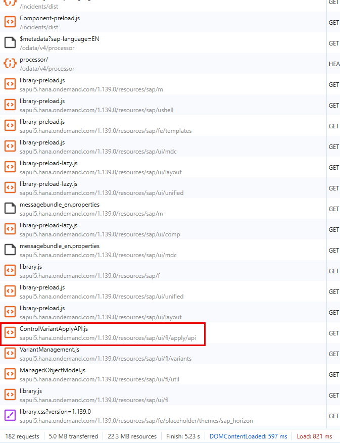
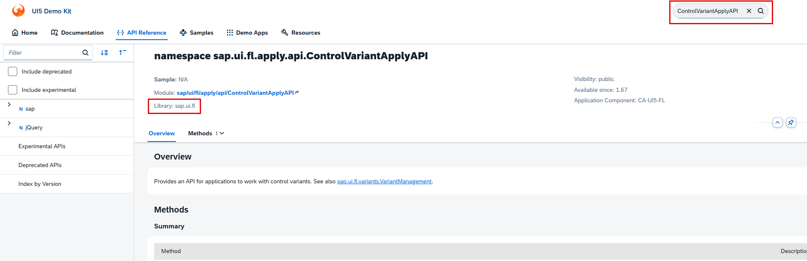

# Exercise 3 - Analyzing network traffic

In this exercise, we will learn how to analyze the network traffic of your built app.
When analyzing the start-up of a fully optimized built app within the network trace, only the following requests should be seen:

- library-preload.js
- messagebundle.properties
- library.css
- manifest.json
- fonts (.woff2)
- some icons or images
- some personalization requests
- component-preload.js
- OData requests. First a $metadata request, often followed by a head request. After that, $batch request(s) to get the actual data.

The actual number of requests depends on how the application is started, but usually it would be less than ca. 100 requests. Any bigger number might indicate a problem and we should always double-checked it to make sure that it is fully optimized.

Requests for individual or single JavaScript resources should in general be avoided and they should be bundled.  

This is an example of a request for a single resource:



Compare it with this bundle request:



## Exercise 3.1 Check the network traffic

After completing these steps you will have learnt how to confirm that your application is fully optimized or whether it is lacking some performance improvements.

1. Open Visual Studio Code and open the folder `teched2025-CA262`. Then, open a new terminal via `View -> Terminal` or reuse the one you opened previously. Finally, run the following command:

   ```sh
   npm start
   ```

2. With the built application running in your browser ([http://localhost:4004/incidents/dist/index.html](http://localhost:4004/incidents/dist/index.html)), open Chrome Developer Tools in the same tab by pressing `F12` or right-clicking anywhere on the page and selecting `Inspect`. Go to the `Network` tab.

3. To record all network requests during the first load of the application, you need to disable the cache in DevTools.

   

   Then clear any previous recordings by clicking the clear button in the Network tab.

   

4. Now reload the page by pressing `F5` or clicking the reload button in the browser. This will record all network activity for the initial load of the application.

   > [!TIP]
   > Since there are many library-preload requests and it is not too easy to tell them apart, enable the `Big request rows` checkbox in the `Network Settings`.

   

## Exercise 3.2 Identify missing library dependencies

After completing these steps you will have learnt how to identify missing dependencies and how to correct them.

Missing library dependencies can happen when we rely on tools that might have a missing dependency or when we forgot to add it. That's why it is considered good practice to double-check once the application is built.

1. Have a look at the requests that you see in the Network Tab from the previous exercise. Compare them with the list of expected requests from above. Is there something that seems odd? How many requests are in total? Spend some time analyzing the network trace before continuing.

2. Currently, you should see 353 requests (maybe 352 due to the favicon.ico request). Scroll to the top. The request FilterOperatorUtil.js is the first one that doesn't follow the list given above. If we keep scrolling down, we see that there are few similar requests. This usually indicates a missing library dependency.

   

3. In order to find out which library is missing, the best option is to check the UI5 documentation. Open the [UI5 Demo Kit](https://sapui5.hana.ondemand.com/) and navigate to the API Reference.

   

4. Enter the name of the request in the filter box. In this case, we should enter FilterOperatorUtil. Click on the result. It will open the documentation of this element. The library is visible on the top part. It is sap.ui.mdc.

   

## Exercise 3.3 Add the missing library dependency

1. Go back to Visual Studio Code and open the `manifest.json` file located in folder `app/incidents/webapp`. Navigate to the attribute "sap.ui5"."dependencies"."libs". It should have 4 dependencies, sap.m, sap.ui.core, sap.ushell and sap.fe.templates. Add the sap.ui.mdc library to the list.

   

2. Let's keep the previous build version so we can compare them later. Rename the folder `app/incidents/dist` into `app/incidents/dist_first_build`.

3. Go back to Visual Studio Code and build the application from the terminal with the following command:

   ```sh
   npm run build:preload
   ```

4. This generates a new built version in folder `app/incidents/dist`. Go back to the browser and reload the page by pressing `F5`.

5. Have a look at the requests. What do you notice now? You should see that there are no more single requests to artifacts that belong to the sap.ui.mdc library. Also the total number of requests is now down to 182.

## Exercise 3.4 Evaluate and refine until your application is fully optimized

1. On the browser, check again the latest result of the network trace. Is the number of requests less than 100? Do you still see some single requests? Spend again few minutes trying to see if everything is ok.

2. Indeed we can still see some single requests. The next one is ControlVariantApplyAPI.js. Again, navigate to the UI5 Demo Kit and this time, search ControlVariantApplyAPI in the search box. This search also works quite well and should return one result, indicating that the library is sap.ui.fl.

   

   

3. Again, let's keep the build version so we can compare them later. Rename the folder `app/incidents/dist` into `app/incidents/dist_build_mdc`.

4. Repeat the build generation step and reload the application in the browser. Check the network trace. Now the number of requests should be 90.

5. Repeat this exercise until you are satisfied. Remember to rename the `app/incidents/dist` folder after every change since we are going to test them all in the next exercise.

6. Based on the single requests, you should probably have two more versions. The first one should include the library sap.f and the second one should include the library sap.uxap.

## Exercise 3.5 Run some performance tests

Sometimes it is not clear whether a full library should be added as dependency or not. It could be that only 2 components are required from a particular library and therefore it might be faster to load just those two components instead of one full library. Size also matters. And size matters in two respects. First one is the download time. One might argue that this happens only the first time and later the request is cached in the browser. Granted. But also any js file, regardless of the origin, browser cache or network, must be parsed. This processing time needs to be considered when optimizing an application.

When executing performance tests, it is important to keep in mind that nothing is perfect. Network might be collapsed, the CPU is busy doing something else, etc. In order to avoid this, we will repeat our tests at least 10 times.

Usually performance tests are done:

- in a dedicated environment
- with a high number of iterations
- automatic outlier identification and elimination
- tests over time to identify regressions
- and some more...

Let's keep things simple. We are going to repeat each test 10 times and we will simply calculated the average of the numbers.

1. Go back to Visual Studio Code and make sure you have different build folders. You should have at least five:

   - `app/incidents/dist_first_build`
   - `app/incidents/dist_build_mdc`
   - `app/incidents/dist_build_mdc_fl`
   - `app/incidents/dist_build_mdc_fl_f`
   - `app/incidents/dist_build_mdc_fl_f_uxap`

2. Go back to the browser and open the URL or the first build: [http://localhost:4004/incidents/dist_first_build/index.html](http://localhost:4004/incidents/dist_first_build/index.html)

3. Make sure you still have the cache disabled in DevTools.

4. Write down the values of:

   - Number of requests
   - Amount of bytes transferred over network
   - Amount of bytes loaded by the page
   - Finish time

5. Repeat this 10 times, that is, refresh the page with `F5` and write down the values.

6. Repeat this procedure for all the different builds you have:

   - [http://localhost:4004/incidents/dist_build_mdc/index.html](http://localhost:4004/incidents/dist_build_mdc/index.html)
   - [http://localhost:4004/incidents/dist_build_mdc_fl/index.html](http://localhost:4004/incidents/dist_build_mdc_fl/index.html)
   - [http://localhost:4004/incidents/dist_build_mdc_fl_f/index.html](http://localhost:4004/incidents/dist_build_mdc_fl_f/index.html)
   - [http://localhost:4004/incidents/dist_build_mdc_fl_f_uxap/index.html](http://localhost:4004/incidents/dist_build_mdc_fl_f_uxap/index.html)

7. Fill the following table with all the values. It should look like this one:

   | Build | Number of requests | Bytes transferred | Bytes loaded | Average finish time | Iteration 1 | Iteration 2 | Iteration 3 | Iteration 4 | Iteration 5 | Iteration 6 | Iteration 7 | Iteration 8 | Iteration 9 | Iteration 10 |
   | --- | --- | --- | --- | --- | --- | --- | --- | --- | --- | --- | --- | --- | --- | --- |
   | First Build | 353 | 5,1 MB | 22,1 MB | 6,77 s | 9,18 s | 6,09 s | 6,92 s | 8,93 s | 4,53 s | 5,72 s | 8,55 s | 7,57 s | 5,9 s | 4,31 s |
   | Build with MDC | 182 | 5,0 MB | 22,3 MB | 4,64 s | 4,99 s | 3,01 s | 3,59 s | 4,74 s | 4,66 s | 5,35 s | 4,99 s | 5,05 s | 4,96 s | 5,05 s |
   | Build with MDC and FL | 90 | 4,9 MB | 22,4 MB | 3,34 s | 2,02 s | 2,15 s | 3,91 s | 3,35 s | 3,66 s | 3,62 s | 3,88 s | 3,79 s | 3,35 s | 3,73 s |
   | Build with MDC, FL and F | 78 | 4,9 MB | 22,4 MB | 3,01 s | 2,96 s | 1,96 s | 2,72 s | 3,44 s | 3,25 s | 3,00 s | 3,28 s | 3,22 s | 3,27 s | 3,05 s |
   | Build with MDC, FL, F and UXAP | 77 | 5,0 MB | 22,8 MB | 2,56 s | 3,14 s | 1,88 s | 2,22 s | 1,81 s | 2,32 s | 2,24 s | 2,77 s | 3,28 s | 3,19 s | 2,82 s |

8. Now uncheck the disable cache and run the tests again:

   | Build | Number of requests | Bytes transferred | Bytes loaded | Average finish time | Iteration 1 | Iteration 2 | Iteration 3 | Iteration 4 | Iteration 5 | Iteration 6 | Iteration 7 | Iteration 8 | Iteration 9 | Iteration 10 |
   | --- | --- | --- | --- | --- | --- | --- | --- | --- | --- | --- | --- | --- | --- | --- |
   | First Build | 352 | 4,3 kB | 22,0 MB | 1,91 s | 1,95 s | 2,22 s | 1,97 s | 1,57 s | 1,55 s | 1,57 s | 1,72 s | 1,85 s | 2,31 s | 2,44 s |
   | Build with MDC and FL | 181 | 4,3 kB | 22,3 MB | 2,25 s | 1,92 s | 1,66  s | 3,61 s | 2,63 s | 2,43 s | 1,65 s | 2,06 s | 2,11 s | 2,13 s | 2,38 s |
   | Build with MDC and FL | 89 | 4,3 kB | 22,4 MB | 1,87 s | 1,97 s | 1,28 s | 1,31 s | 2,09 s | 2,00 s | 2,12 s | 2,11 s | 2,01 s | 1,99 s | 1,87 s |
   | Build with MDC, FL and F | 77 | 4,3 kB | 22,4 MB | 2,18 s | 1,87 s | 3,10 s | 2,63 s | 2,37 s | 2,03 s | 1,99 s | 2,34 s | 2,05 s | 1,82 s | 1,69 s |
   | Build with MDC, FL, F and UXAP | 76 | 4,3 kB | 22,8 MB | 1,63 s | 1,99 s | 1,20 s | 1,27 s | 1,71 s | 2,13 s | 1,91 s | 1,56 s | 1,49 s | 1,48 s | 1,61 s |

Since we are running these tests locally, we all should have similar results. In this case, they clearly show that including as much library dependencies as required will improve the loading time, both without and with browser cache.

## Summary

You've now learnt how to use the analyze the network traffic of the built app and how to recognize which requests are ok and which ones can be improved. Also, you have now compared the performance of different build configurations and learn about the importance of statistical data.

> [!IMPORTANT]
> **Kudos!** :trophy:  
> You have completed the third exercise successfully.  
> You seem to become an *Expert* in *Analyzing network traffic*.  
> Continue to - [Exercise 4 - Analyzing OData requests](../ex4/README.md)
