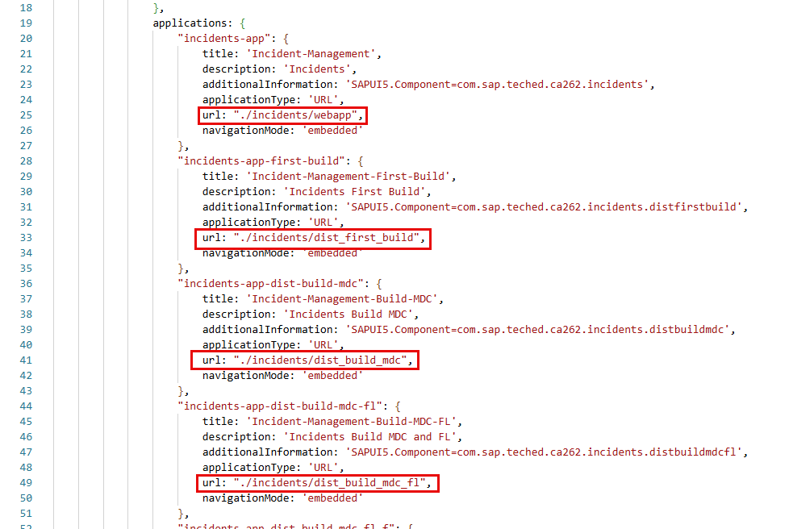
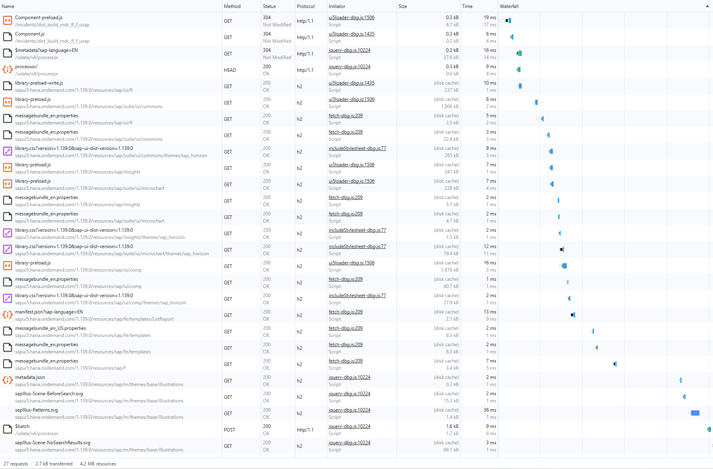
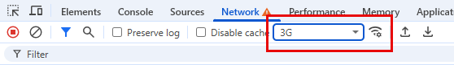
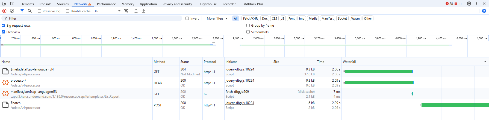
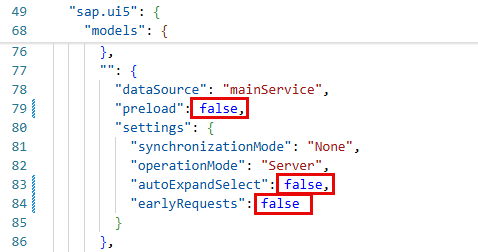
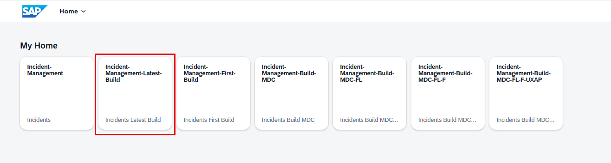
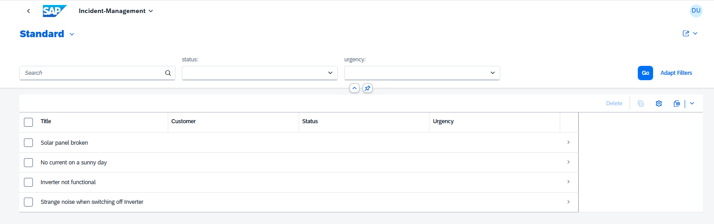
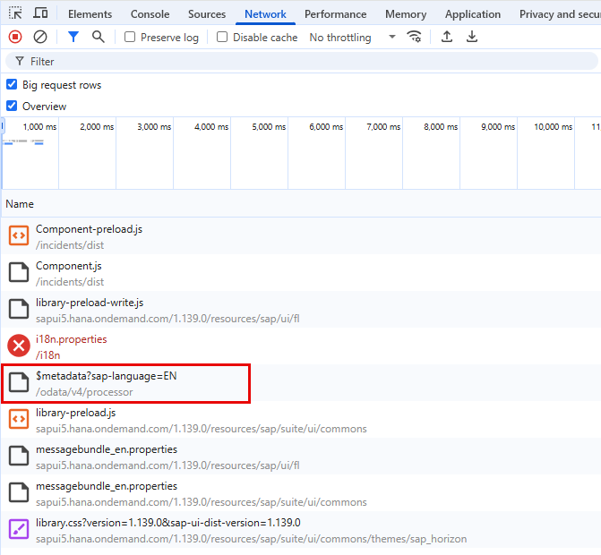
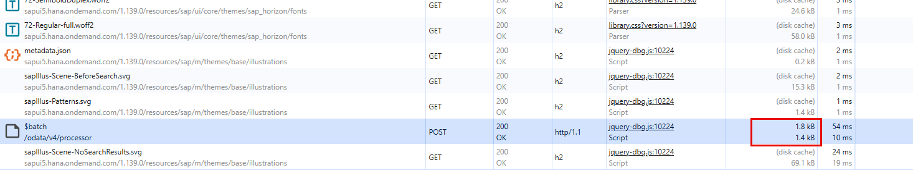
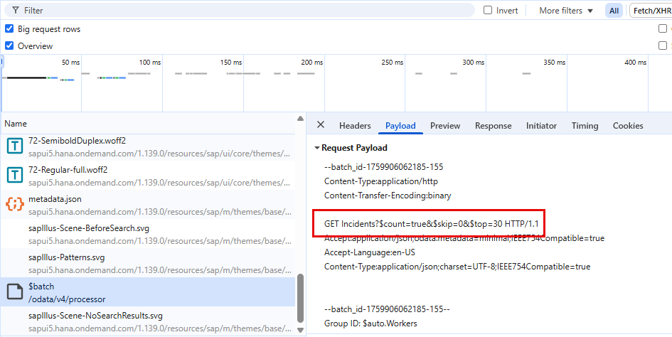

# Exercise 4 - Analyzing OData requests

In this exercise, we will learn how to analyze the OData requests of your built app.

OData is a standard protocol for creating and consuming data by using simple HTTP and REST APIs for create, read, update, delete (CRUD) operations.
We saw in exercise 1.3 that some requests are cached in the browser and others aren't. In general, static resources, like application source code or ui5 libraries, should always be cached.
Depending on the environment, the requests that are never cached are:

- index.html
- personalization requests
- OData requests (in ABAP environments, $metadata requests are cached thanks to the cache buster token. See ["Cache Buster for OData Metadata of SAP Fiori Apps"](https://help.sap.com/docs/ABAP_PLATFORM_NEW/a7b390faab1140c087b8926571e942b7/876e43a272cc45cb82dea640edff0ab2.html?locale=en-US&version=LATEST) for more information.)

## Exercise 4.1 Fiori Launchpad

After completing these steps you will have a local launchpad.

1. Open Visual Studio Code and open the folder `teched2025-CA262`. Then, open a new terminal via `View -> Terminal` or reuse the one you open previously. Finally, run the following command:

   ```sh
   npm start
   ```

2. Open the file `app\launchpage.html` and adjust the property URL in all the tiles according to the names you have from exercise 3.5.  

   

3. With the local Fiori Launchpad running in your browser ([http://localhost:4004/launchpage.html](http://localhost:4004/launchpage.html)), open Chrome Developer Tools in the same tab by pressing `F12` or right-clicking anywhere on the page and selecting `Inspect`. Go to the `Network` tab.

4. Make sure the `Disable Cache` checkbox in the `Network Tab` is not checked.

5. Open the application `Incident-Management-Build-MDC-FL-F-UXAP` by clicking on the corresponding tile.

   

The most optimized application starts without problems and you have now prepared your local launchpad so in the next exercises we will see how Fiori Launchpad works, the differences when an app is started from it and the importance of the optimization of OData requests.

## Exercise 4.2 OData request types

After completing these steps you will have learnt how Fiori Launchpad influences the way applications start and which requests are not cached.

1. From the previous exercise, go back to the browser and check the `Network Tab`. You should see:

   - 27 total requests
   - 22 requests are fully cached in the browser
   - 3 requests are cached in the browser, but they need confirmation from the server that the resource cached by the client is still valid
   - 1 head request
   - 1 post request (the OData request fetching the data)

   

   In exercise 3.5, there were 76 requests in this application at start-up. We see less requests for several reasons:
    - First of all, Fiori Launchpad is itself a SAPUI5 app, so all the SAPUI5 core libraries that make SAPUI5 work are loaded.
    - Secondly, Fiori Launchpad has some dependencies to UI5 libraries, which might be shared with the `Incident Management` application. SAPUI5 takes care that any library that has been already requested, won't be requested again, so those common libraries won't be requested again.
    - Finally, any application launched from Fiori Launchpad won't trigger a full reload of the html page. This works because only the hash property of the URL (the part of the URL beginning with and following the # symbol) is changed.

2. Click the "Go back" arrow in the browser. Clear the `Network Log`in the `Developer Tools`. Set the throttling to 3G.

   

3. Open again the application `Incident-Management-Build-MDC-FL-F-UXAP`. Now you should only see 4 requests.

   

   Once the application specific requests were triggered during the first load, static resources should not appear. Manifest.json request is sometimes sent, depending on the environment, so let's skip it for now and let's focus on the OData requests.
   Also, we can see that the first two requests ($metadata and HEAD request) are sent in parallel and the $batch request is sent afterwards.

   - $metadata request contains a complete description of the OData service, including types, properties, relationships, annotations, etc. It is required before we can query the data service.
   - HEAD request is used to get a security token (X-CSRF-Token).
   - \$batch request is a POST request that can contain many individual GET requests. In this case, it has only one GET request:  
      `GET Incidents?$count=true&$select=ID,title&$expand=customer($select=ID,name),status($select=code,criticality,descr),urgency($select=code,descr)&$skip=0&$top=30`.

It is important to understand how OData works. Let's break down the last request:

- GET Incidents: Fetches elements of the entity `Incidents`.
- \$count=true: Adds the total number of elements in the response.
- \$select=ID,title: Specifies which properties (`ID` and `Title`) should be retrieved from entity `Incidents`.
- \$expand: Fetches elements from the relationships:
  - customer($select=ID,name): Fetches the properties `ID` and `Name` from the entity `Customer`.
  - status($select=code,criticality,descr): Fetches the properties `Code`, `Criticality` and `Descr` from the entity `Status`.
  - urgency($select=code,descr): Fetches the properties `Code` and `Descr` from the entity `Urgency`.
- \$skip=0&$top=30: Used for pagination. It means: fetch the first 30 elements starting from the element 0.

This all means that with just one OData request, elements from three different entities, different properties and additional data like number of elements (count) are fetched.

> [!TIP]
> Batching OData requests into a single one reduces the number of round trips. The individual requests will be processed in parallel on an ABAP application server. However, CAP processes them sequentially, so, in complex scenarios, we need to find the right balance between:
>
> - Sending one batch requests with 12 (for example, could be any big number) individual OData requests
> - Sending 12 individual requests to the server
> - Sending 2 batch requests with 6 individual OData requests each. Or maybe 5 and 7. It really depends on the use case.

## Exercise 4.3 Understand OData features in manifest

After completing these steps you will have learnt which attributes of the `manifest.json` file improve the startup performance.

Our application is actually already optimized, but let's set some attributes to false, so we can see the effect.

1. Open the file `app\incidents\webapp\manifest.json` in Visual Studio Code and set to false the attributes:

   - "sap.ui5">"models">"">"preload"
   - "sap.ui5">"models">"">"settings">"autoExpandSelect"
   - "sap.ui5">"models">"">"settings">"earlyRequests"

   

2. Build the application from the terminal with the following command:

   ```sh
   npm run build:preload
   ```

3. This generates a new built version in folder `app/incidents/dist`. Go back to the browser and open the local Fiori Launchpad([http://localhost:4004/launchpage.html](http://localhost:4004/launchpage.html)). Open Chrome Developer Tools in the same tab by pressing `F12` or right-clicking anywhere on the page and selecting `Inspect`. Go to the `Network` tab. Clear the `Network Log`in the `Developer Tools`.

4. Open the application `Incident-Management-Latest-Build` by clicking on the corresponding tile.

   

5. The application now shows the following differences:

   - Customer, Status and Urgency columns are empty
   - \$metadata request is not the second/third request after the component-preload.js (or just Component.js) request
   - \$batch request is not optimized:
     - Size is bigger (1,4kB vs 1,2kB)
     - The internal OData GET request is different: GET Incidents?$count=true&$skip=0&$top=30

   

   

   

   

This application might be small, but it is suitable to learn about performance. The same principles will apply for a complex application.  
The recommendation is the same:

 - Run the build step after development is finished
 - Analyze the network trace at start-up without browser cache and update dependencies until satisfied
 - Analyze the OData requests with cache, making sure the individual GET requests are batched (for ABAP environments) or running in parallel (CAP Back End)

> [!TIP]
> You can learn more about those features in the following links:  
>
> - [Manifest](https://sapui5.hana.ondemand.com/sdk/#/topic/be0cf40f61184b358b5faedaec98b2da)
> - [Manifest Preload](https://sapui5.hana.ondemand.com/sdk/#/topic/26ba6a5c1e5c417f8b21cce1411dba2c)
> - [Automatic determination of $expand and $select](https://sapui5.hana.ondemand.com/sdk/#/topic/10ca58b701414f7f93cd97156f898f80)
> - [Performance Aspects, including Early Request feature](https://sapui5.hana.ondemand.com/sdk/#/topic/5a0d286c5606424b8e0d663c87445733)

## Summary

You have now learnt the different types of OData requests and how to optimize them.  

> [!IMPORTANT]
> **Wow!** :clap:  
> You have officially completed the final exercise of CA262 as part of SAP TechEd 2025.  
> We hope that we were able to demonstrate how easy it is to *Analyze and optimize front-end application performance*.  
> Go back to the [Overview](../../) of this repository.
