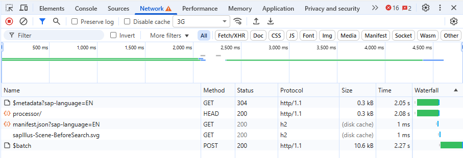
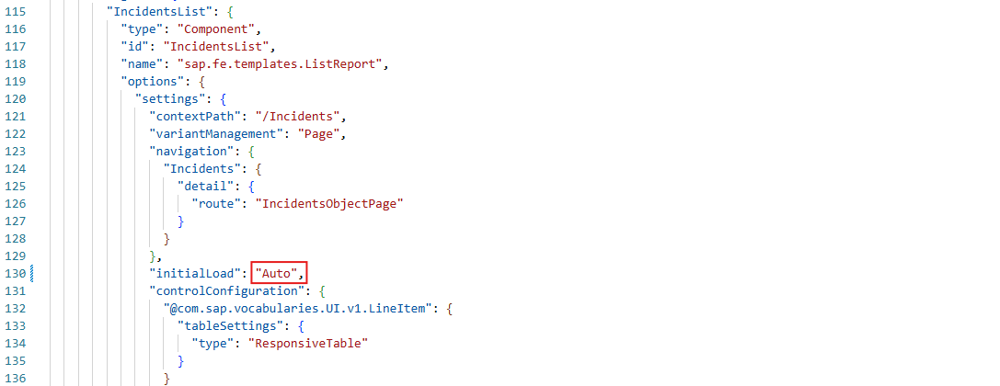
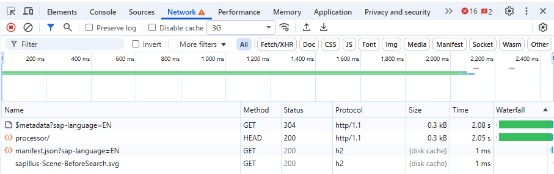
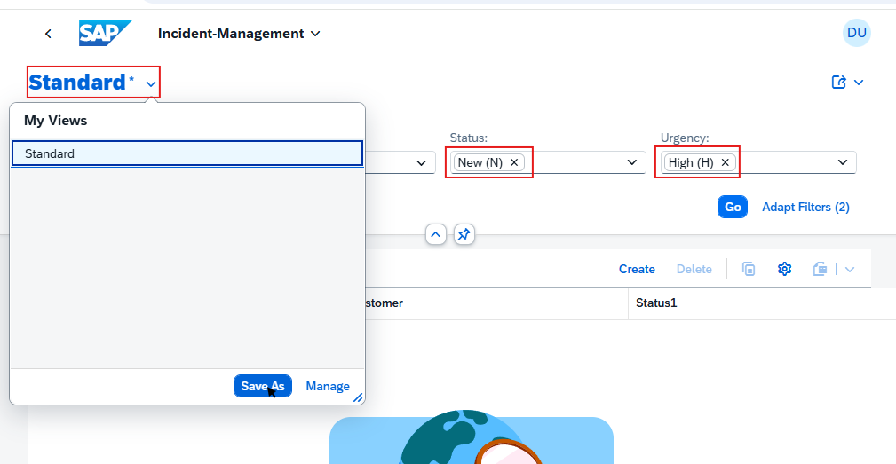
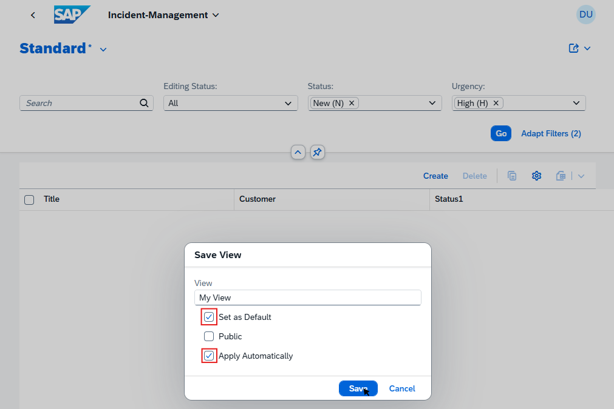
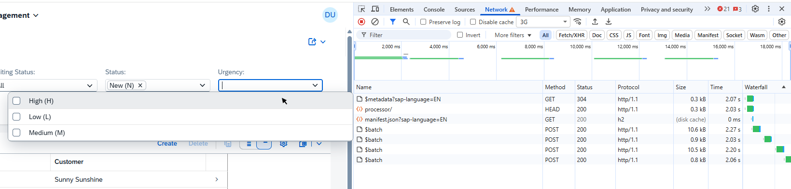

# (Bonus) Exercise 5 - Initial Load and Live Mode

In this bonus exercise, you will learn about the performance impact of the "Initial Load" and "Live Mode" settings for the List Report.

Fiori elements allow you to configure the behavior of List Report pages. Depending on the network conditions and the amount and complexity of the data, you can optimize the user experience by adjusting these settings.

## (Bonus) Exercise 5.1 - Initial Load

After completing these steps you will understand the impact of the "Initial Load" setting on startup performance of your application.
You will be able to decide whether to enable or disable the initial load based on the typical usage scenarios of your application.

1. First, revert the changes you made in the previous exercises to the `manifest.json` file of the `incidents` app.
   Open the file `app\incidents\webapp\manifest.json` in Visual Studio Code and reset the attributes to true:

   - "sap.ui5">"models">"">"preload": true
   - "sap.ui5">"models">"">"settings">"autoExpandSelect": true
   - "sap.ui5">"models">"">"settings">"earlyRequests": true

   Save the file and rebuild the app in the terminal of Visual Studio Code using the command:

   ```sh
   npm run build:preload
   ```

2. To have a slightly more realistic data volume, we have prepared a larger dataset in the folder `db\data_large`.
   To make use of this dataset, you have to rename the existing `data` folder to `data_small` and then rename the `data_large` folder to `data`.
   Finally, the server needs to be restarted to pick up the new data. Go to the terminal where the server is running and stop it with `Ctrl+C` and confirm with `y`.
   Then, start it using the following command:
  
   ```sh
   npm start
   ```

3. Open the app in Chrome via the URL `http://localhost:4004/launchpage.html`. Repeat the navigation steps from exercises 4.1 and 4.2:
   1. Click on the tile `Incident-Management-Latest-Build`.
   2. Navigate back to the Launchpad.
   3. Enable the developer tools in Chrome (F12) and make sure that the cache is enabled. Clear the `Network Log` and set the throttling to `3G`.
   4. Click again on the tile `Incident-Management-Latest-Build`.

   You should see something like this:

   

   The OData request happens sequentially to the other requests and therefore increases the overall loading time of the application.
   Also try to see when the application becomes visible and interactive for the user. I.e. when can the user start entering custom filter criteria?

   In a scenario with either slow network or a complicated data model, the OData request might take a while. If the typical scenario of your application is that users nearly always want to specify custom filters before seeing any data, the initial load is not necessary and just slows down the user experience. We will now disable it in the next step.

4. To disable the initial load, open the file `app\incidents\webapp\manifest.json` in Visual Studio Code and change the following attribute to "Auto":

   - "sap.ui5">"routing">"targets">"IncidentsList">"options">"settings">"initialLoad" : "Auto"

   

   See the [UI5 Demo Kit documentation](https://sapui5.hana.ondemand.com/sdk/#/topic/9f4e1192f1384b85bc160288e17f69c4) for more details on the different options for this setting.

   Save the file and rebuild the app in the terminal of Visual Studio Code using the command:

   ```sh
   npm run build:preload
   ```

   Repeat the same steps as in step 3 above to open the application and record the network traffic.

   You should see something like this in the network log:

   

   The OData request is now skipped, the application loads faster and the user can directly start entering custom filter criteria. The OData request will only be sent when the user clicks on the "Go" button.

5. In the previous step we have set the "Initial Load" setting to "Auto". This means that the initial load is only performed if there are predefined filter criteria filters set. This allows users to directly see the data that they are interested in when opening the application, without having to click the "Go" button.

   To see this in action, navigate to the application ´Incident-Management-Latest-Build´ and enter some filter criteria for "Status" and "Urgency". Then, instead of clicking the "Go" button, bookmark the URL or copy it to a new tab and open it.

   Then click on the dropdown expander text to the "Standard" view and save the current filter settings as a new View.
   
   

   Give it an appropriate name, e.g. "My View" and make sure to select the options "Set as Default" and "Apply Automatically". Then click "Save".

   

   Now, navigate back to the Launchpad and click again on the tile `Incident-Management-Latest-Build`. You should see that the data is directly loaded without having to click the "Go" button, as the saved view contains predefined filter criteria.

## (Bonus) Exercise 5.2 - Live Mode

After completing these steps you will understand the impact of the "Live Mode" setting on the user experience of your application.
You will better understand whether that setting is suitable for your application or not.

1. We now explore the relevance of the "Live Mode" setting ([Documentation in the UI5 Demo Kit](https://sapui5.hana.ondemand.com/sdk/#/topic/4bd7590569c74c61a0124c6e370030f6.html#loio4bd7590569c74c61a0124c6e370030f6/live_mode)) on the perceived performance of the application.
   When the "Live Mode" is enabled for a list report, data is loaded from the backend while modifying filter criteria. This can improve the user experience in scenarios with fast networks and simple data models, as the user sees data while configuring filters.
   To enable the "Live Mode" for our incidents list report, open the file `app\incidents\webapp\manifest.json` in Visual Studio Code and change the following attribute to `true`:

   - "sap.ui5">"routing">"targets">"IncidentsList">"options">"settings">"liveMode" : true

   
  
   Save the file and rebuild the app in the terminal of Visual Studio Code using the command:

   ```sh
   npm run build:preload
   ```

   Note: The "Live Mode" overrules the "Initial Load" setting. Therefore, even if the initial load is disabled, data will be loaded on the initial loading of the application.

2. Repeat the same steps as in exercise 5.1 step 3 above to open the application and record the network traffic.
   1. Open the app in Chrome via the URL `http://localhost:4004/launchpage.html`.
   2. Click on the tile `Incident-Management-Latest-Build`.
   3. Navigate back to the Launchpad.
   4. Enable the developer tools in Chrome (F12) and make sure that the cache is enabled. Clear the `Network Log` and set the throttling to `3G`.
   5. Click again on the tile `Incident-Management-Latest-Build` and change to the "Standard" view in case you have still set the custom View as default.

   Now you can start entering filter criteria for "Status" and "Urgency". Have a look at the network log and try to understand which requests are sent why and when. You should see something like this:

   

   You'll likely notice that under these conditions (slow network, or alternatively a complex data model), the live mode can lead to a degraded user experience. For these scenarios you should consider disabling the live mode.

3. If you like, you can also repeat the above steps with throttling disabled to see how the live mode can improve the user experience in fast network/simple data model scenarios.

> [!IMPORTANT]
> **Wow!** :clap:  
> You have now even completed the (Bonus) Exercise 5 of CA262 as part of SAP TechEd 2025.  
> Thank you for participating and we hope you enjoyed learning how to *Analyze and optimize front-end application performance*.  
> Go back to the [Overview](../../README.md) of this repository.
>